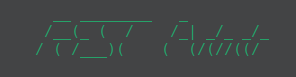

# rest-architecture-automator

# 

- `main`: diretório principal do projeto.
- `java`: diretório para o código fonte em Java.
- `com`: diretório raiz dos pacotes Java.
- `AppExample`: nome da aplicação.
- `app`: pacote da aplicação.
- `persistence`: pacote que contém as entidades do banco de dados.
- `entity`: pacote que contém as classes que representam as tabelas do banco de dados.
- `repository`: pacote que contém as classes que implementam as interfaces dos repositórios.
- `service`: pacote que contém as classes de serviços da aplicação.
- `cors`: pacote que contém as classes responsáveis por configurar o Cross-Origin Resource Sharing (CORS).
- `model`: pacote que contém as classes de modelo da aplicação.
- `token`: pacote que contém as classes responsáveis por gerar e validar tokens de autenticação.
- `web`: pacote que contém as classes responsáveis pela comunicação web.
- `controller`: pacote que contém as classes controladoras da aplicação.
- `mapper`: pacote que contém as classes que realizam a conversão de objetos entre as camadas da aplicação.

Esta é a estrutura do projeto default e cada diretório possui sua respectiva descrição.

```
.
├── main
│   └── java
│       └── com
│           └── AppExample
│               └── app
│                   ├── persistence
│                   │   └── entity
│                   │
│                   ├── repository
│                   │
│                   ├── service
│                   │   ├── cors
│                   │   │
│                   │   ├── model
│                   │   │
│                   │   └── token
│                   │       
│                   └── web
│                       ├── controller
│                       │
│                       └── mapper
```
